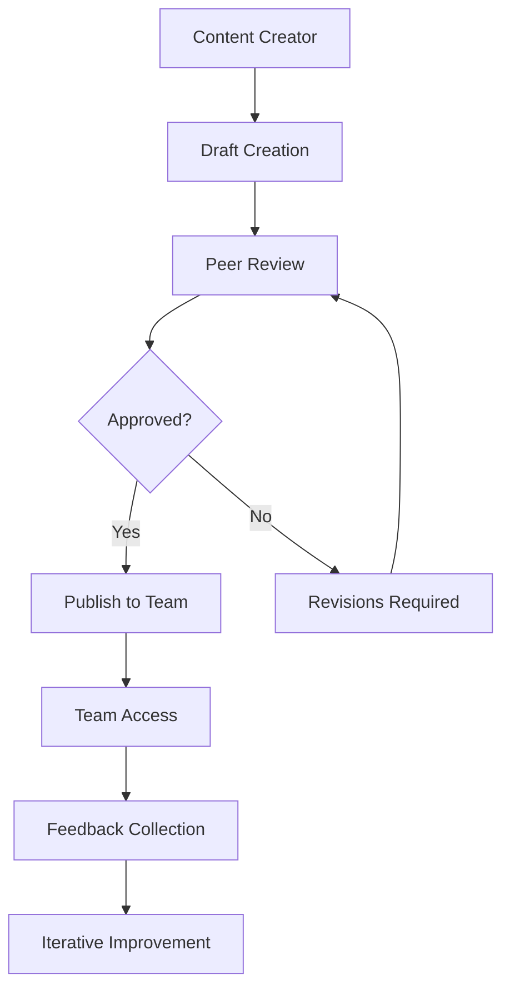

# Content Organization and Team Collaboration

## **Overview**

Master advanced content organization strategies and collaborative workflows that enable teams to work efficiently with shared analytics resources. Learn folder structures, permission management, and collaboration patterns that scale across organizations.

## **Key Learning Objectives**

- **Content Architecture**: Design scalable folder and organization systems
- **Team Collaboration**: Enable effective multi-user collaboration workflows
- **Permission Management**: Implement granular access controls
- **Version Control**: Manage content changes and collaboration safely

## **Content Organization Strategies**

### **1. Hierarchical Folder Structure**
```markdown
📁 Omni Workspace
├── 📁 Executive Dashboard
│   ├── 📊 CEO Weekly Summary
│   ├── 📊 Board Meeting Metrics
│   └── 📊 Investor Relations KPIs
├── 📁 Sales Analytics
│   ├── 📁 Regional Performance
│   ├── 📁 Product Analysis
│   └── 📁 Pipeline Management
├── 📁 Marketing Intelligence
│   ├── 📁 Campaign Performance
│   ├── 📁 Lead Generation
│   └── 📁 Customer Journey
└── 📁 Operations Reporting
    ├── 📁 Daily Operations
    ├── 📁 Resource Planning
    └── 📁 Quality Metrics
```

### **2. Content Tagging and Metadata**
```yaml
# Content metadata structure
workbook:
  title: "Q4 Sales Performance Dashboard"
  tags:
    - sales
    - quarterly
    - performance
    - executive
  metadata:
    department: "Sales"
    owner: "john.doe@company.com"
    created: "2024-01-15"
    last_modified: "2024-01-20"
    access_level: "department"
    data_sources:
      - "salesforce"
      - "hubspot"
      - "financial_warehouse"
  business_context:
    purpose: "Track quarterly sales performance and identify trends"
    audience: "Sales leadership and executives"
    update_frequency: "Daily"
```

### **3. Smart Organization Features**
- **Auto-Categorization**: AI suggests folder placement based on content
- **Content Discovery**: Search across all organizational content
- **Usage Analytics**: Track which content is most valuable
- **Relationship Mapping**: Understand content dependencies

## **Team Collaboration Workflows**

### **1. Collaborative Development Process**


### **2. Real-Time Collaboration Features**
- **Co-editing**: Multiple users can edit simultaneously
- **Comment System**: Contextual feedback and discussions
- **Change Tracking**: Visual indicators of recent modifications
- **Activity Streams**: Real-time updates on team activities

### **3. Workflow Automation**
```yaml
# Automated collaboration workflows
workflows:
  content_approval:
    trigger: "content_creation"
    steps:
      - assign_reviewer: "department_lead"
      - notify_stakeholders: "email"
      - await_approval: "72_hours"
      - auto_publish: "on_approval"
      
  regular_review:
    trigger: "monthly"
    steps:
      - identify_stale_content: "90_days_inactive"
      - notify_owners: "review_required"
      - schedule_cleanup: "content_archival"
      
  usage_monitoring:
    trigger: "continuous"
    steps:
      - track_access_patterns: "all_users"
      - identify_popular_content: "trending"
      - suggest_promotions: "broader_access"
```

## **Advanced Permission Management**

### **1. Role-Based Access Control (RBAC)**
```yaml
# Permission structure
roles:
  content_creator:
    permissions:
      - create_content
      - edit_own_content
      - share_within_department
      - view_department_content
      
  department_lead:
    permissions:
      - all_content_creator_permissions
      - approve_content
      - manage_department_permissions
      - access_usage_analytics
      
  executive:
    permissions:
      - view_all_content
      - access_executive_dashboards
      - export_restricted_data
      - approve_cross_department_sharing
      
  analyst:
    permissions:
      - advanced_analysis_tools
      - create_complex_queries
      - access_raw_data
      - share_analysis_insights
```

### **2. Dynamic Permission Groups**
```sql
-- Automatic permission assignment based on attributes
CREATE OR REPLACE FUNCTION assign_content_permissions(
  user_id VARCHAR,
  content_id VARCHAR
)
RETURNS OBJECT
LANGUAGE SQL
AS
$$
BEGIN
  -- Determine user's department and role
  LET user_info := (
    SELECT department, role, seniority_level 
    FROM users 
    WHERE id = user_id
  );
  
  -- Determine content sensitivity and department
  LET content_info := (
    SELECT department, sensitivity_level, content_type
    FROM content_metadata
    WHERE id = content_id
  );
  
  -- Apply dynamic permissions
  RETURN CASE
    WHEN user_info.department = content_info.department THEN
      OBJECT_CONSTRUCT('access', 'full', 'edit', true, 'share', true)
    WHEN user_info.seniority_level = 'executive' THEN
      OBJECT_CONSTRUCT('access', 'read', 'edit', false, 'share', false)
    WHEN content_info.sensitivity_level = 'public' THEN
      OBJECT_CONSTRUCT('access', 'read', 'edit', false, 'share', true)
    ELSE
      OBJECT_CONSTRUCT('access', 'none', 'edit', false, 'share', false)
  END;
END;
$$;
```

### **3. Conditional Access Controls**
- **Time-based Access**: Content available only during business hours
- **Location-based Access**: Restrict access by geographic location
- **Device-based Access**: Control access by device type or security status
- **Context-based Access**: Access based on current business context

## **Collaboration Tools and Features**

### **1. Commenting and Annotation System**
```javascript
// Advanced commenting functionality
const commentingSystem = {
  contextual: {
    chartAnnotations: true,
    dataPointComments: true,
    visualHighlights: true
  },
  
  collaborative: {
    threadedDiscussions: true,
    mentionNotifications: true,
    statusTracking: true
  },
  
  integration: {
    emailNotifications: true,
    slackIntegration: true,
    taskCreation: true
  }
};

// Create contextual comment
workbook.addComment({
  type: 'chart_annotation',
  chartId: 'revenue_trend',
  position: { x: 150, y: 75 },
  content: 'Significant drop here - investigate marketing spend reduction',
  author: currentUser.id,
  visibility: 'team',
  priority: 'high'
});
```

### **2. Version Control and History**
```sql
-- Content version tracking
SELECT 
  cv.version_number,
  cv.created_by,
  cv.created_at,
  cv.change_summary,
  cv.approval_status,
  u.name as author_name
FROM content_versions cv
JOIN users u ON cv.created_by = u.id
WHERE cv.content_id = 'sales_dashboard_q4'
ORDER BY cv.version_number DESC;

-- Compare versions
SELECT 
  compare_content_versions(
    'sales_dashboard_q4',
    'v1.2',
    'v1.3'
  ) as version_differences;
```

### **3. Collaborative Planning Tools**
```markdown
# Content Planning Workflow

## Sprint Planning
- **Content Roadmap**: Plan quarterly content development
- **Resource Allocation**: Assign team members to content projects
- **Dependency Tracking**: Identify content dependencies and blockers
- **Timeline Management**: Set and track content delivery milestones

## Review Cycles
- **Weekly Reviews**: Regular team check-ins on content progress
- **Monthly Assessments**: Evaluate content performance and usage
- **Quarterly Planning**: Strategic content planning and prioritization
- **Annual Audits**: Comprehensive content audit and cleanup
```

## **Team Productivity Features**

### **1. Workspace Personalization**
```javascript
// Personal workspace configuration
const personalWorkspace = {
  layout: {
    favoriteContent: ['daily_metrics', 'team_performance'],
    recentActivity: { limit: 10, timeframe: '7d' },
    quickActions: ['create_dashboard', 'share_insight', 'schedule_report']
  },
  
  notifications: {
    contentUpdates: 'immediate',
    teamActivities: 'daily_digest',
    systemAlerts: 'immediate',
    commentMentions: 'immediate'
  },
  
  preferences: {
    defaultView: 'grid',
    sortBy: 'last_modified',
    theme: 'auto',
    language: 'en-US'
  }
};
```

### **2. Team Activity Dashboard**
```sql
-- Team collaboration metrics
SELECT 
  team_name,
  count(distinct c.id) as total_content,
  count(distinct ca.user_id) as active_collaborators,
  sum(ca.contributions) as total_contributions,
  avg(cr.rating) as avg_content_rating
FROM teams t
JOIN content c ON t.id = c.team_id
JOIN content_activity ca ON c.id = ca.content_id
LEFT JOIN content_ratings cr ON c.id = cr.content_id
WHERE ca.activity_date >= current_date - interval '30 days'
GROUP BY team_name
ORDER BY total_contributions DESC;
```

### **3. Knowledge Sharing Platform**
- **Best Practices Library**: Curated collection of exemplary content
- **Template Marketplace**: Reusable templates for common use cases
- **Learning Resources**: Training materials and documentation
- **Community Forums**: Discussion spaces for questions and ideas

## **Governance and Compliance**

### **1. Content Governance Framework**
```yaml
governance_policies:
  content_standards:
    naming_conventions: "department_purpose_version"
    documentation_required: true
    approval_process: "peer_review"
    retention_policy: "3_years"
    
  data_governance:
    source_documentation: "mandatory"
    refresh_schedules: "defined"
    quality_checks: "automated"
    lineage_tracking: "complete"
    
  access_governance:
    principle: "least_privilege"
    review_frequency: "quarterly"
    audit_logging: "comprehensive"
    emergency_access: "approved_only"
```

### **2. Compliance Monitoring**
```sql
-- Governance compliance tracking
SELECT 
  compliance_metric,
  current_score,
  target_score,
  compliance_percentage,
  improvement_actions
FROM governance_scorecard
WHERE evaluation_date = current_date;

-- Content audit trail
SELECT 
  content_id,
  action_type,
  user_id,
  timestamp,
  details
FROM content_audit_log
WHERE timestamp >= current_date - interval '90 days'
ORDER BY timestamp DESC;
```

## **Scaling Collaboration**

### **1. Enterprise Features**
- **Multi-tenant Support**: Separate workspaces for different business units
- **Cross-functional Teams**: Collaboration across organizational boundaries
- **External Collaboration**: Secure sharing with external partners
- **Global Distribution**: Support for distributed teams across time zones

### **2. Integration Ecosystem**
```javascript
// Third-party integrations for collaboration
const integrations = {
  communication: {
    slack: { enabled: true, webhooks: ['content_updates', 'mentions'] },
    teams: { enabled: true, bots: ['omni_assistant'] },
    email: { enabled: true, templates: 'custom' }
  },
  
  productivity: {
    jira: { enabled: true, issue_creation: true },
    asana: { enabled: true, task_sync: true },
    confluence: { enabled: true, documentation_sync: true }
  },
  
  security: {
    okta: { sso: true, provisioning: 'automatic' },
    azure_ad: { groups: true, conditional_access: true }
  }
};
```

## **Next Steps**

After mastering content organization and collaboration:
1. **Explore Automated Delivery Systems** → Lesson 5
2. **Implement Team Workflows** → Set up collaborative processes
3. **Design Governance Framework** → Establish content governance
4. **Monitor Team Productivity** → Track collaboration effectiveness

---

*Build a collaborative analytics culture with organized content, effective workflows, and team-centric features.* 